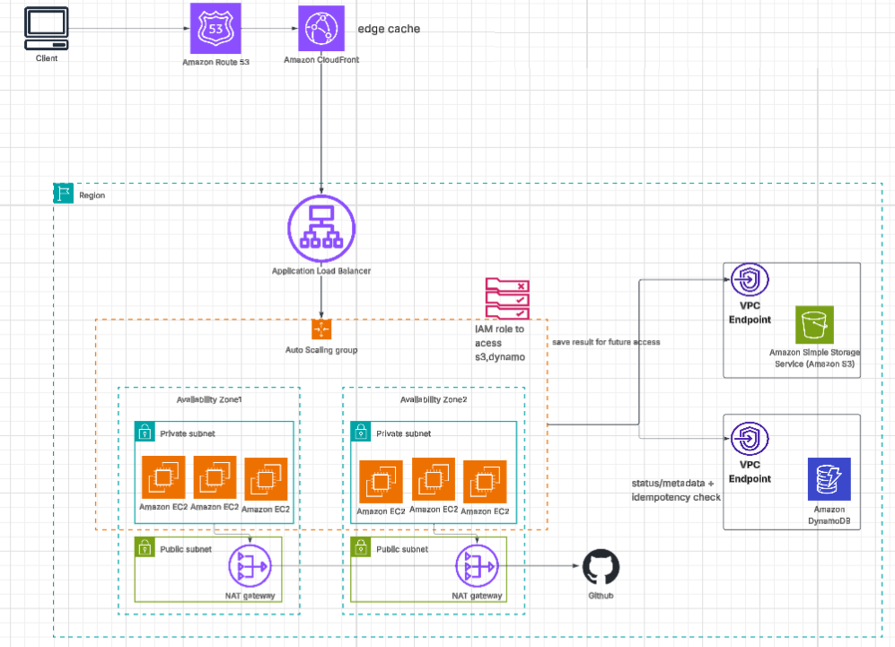
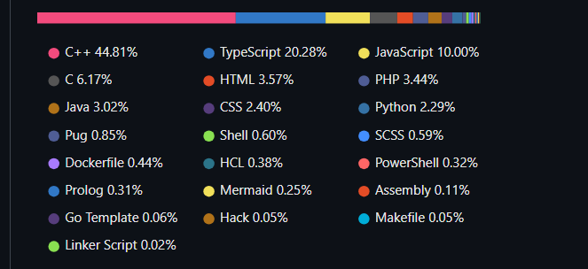

# github-stats

GitHub language stats card served from a load-balanced EC2 fleet. Send a GitHub username, get back an SVG showing their language breakdown (top bar + legend), styled after GitHub's own contribution language chart.

**Architecture diagram:** [view in Lucidchart](https://lucid.app/lucidchart/f4ec9a56-1433-4f75-8769-183af07837bb/edit?viewport_loc=-3785%2C-1641%2C4955%2C2440%2C0_0&invitationId=inv_41e5532b-8fba-4c88-9640-270c048444d1)





## Repo layout

```
app/                          Node.js app — the actual GitHub-stats logic
  github.js                    Fetches repos + per-repo languages from GitHub, aggregates bytes -> percentages
  render.js                    Renders the SVG card (top bar + dot legend)
  server.js                    Express server: checks cache, calls GitHub on a miss, writes back to cache
  package.json
  logger.js 
  instance-metadata.js

cloudformation/
  template.yaml                CloudFormation for the deployed (scoped-down) stack: ALB + EC2 (public subnet) + S3 cache
  github-stats-full-architecture.yaml   Full architecture from the diagram: CloudFront + ALB + ASG (private subnets) + 2x NAT + S3 + DynamoDB, both with VPC gateway endpoints
  deploy.sh                    Uploads app code to S3, then deploys/updates the CloudFormation stack
  nat-off.sh                   Safely disables the NAT Gateway parameter without resetting other stack parameters

arch.png                       Static export of the Lucidchart diagram
example.png                    Example rendered output for a sample username
```

## Two CloudFormation templates, two different scopes

**`template.yaml`** — what's actually deployed right now. Scoped down for free-tier testing:
- ALB + EC2 (single instance, **public subnet**, no NAT needed)
- S3 bucket for cached SVG cards (1-day lifecycle)
- No DynamoDB, no CloudFront, no private subnets

**`github-stats-full-architecture.yaml`** — the complete design from the diagram:
- CloudFront in front of the ALB (edge cache, keyed on the `username` query string)
- ALB → Auto Scaling Group across 2 AZs, EC2 in **private subnets**
- **2 NAT Gateways** (one per AZ, for true HA) — EC2's only path to the public internet, used solely for calling the GitHub API
- S3 (cards, 7-day lifecycle) and DynamoDB (status/idempotency table, 7-day TTL), both reached via **VPC Gateway Endpoints** — so NAT is never used for AWS-internal traffic
- IAM instance role scoped to exactly: the cards S3 prefix, the app-code S3 bucket, and the DynamoDB table ARN — no wildcards, no static credentials anywhere

Route 53 is intentionally excluded from both templates since it needs an actual registered domain to attach a hosted zone to — both templates output the ALB/CloudFront DNS name directly to use instead.

**Cost note on the full-architecture template:** it provisions 2 NAT Gateways, which have no free tier and bill continuously (~$0.045/hr each + data processed) the instant they exist, independent of traffic. The scoped-down `template.yaml` avoids this entirely by keeping EC2 in a public subnet. Don't leave the full-architecture stack running unattended — `aws cloudformation delete-stack` it when you're done testing.

## How the request flow works

1. Request hits `/stats?username=<github-user>`
2. App checks the S3 cache (`cards/<username>.svg`) — serves directly if present and fresh (`X-Cache: HIT`)
3. On a miss: calls the GitHub API (paginated repo list, then per-repo languages fetched concurrently), aggregates bytes per language, renders the SVG
4. Writes the result to S3, returns it (`X-Cache: MISS`)
5. In the full-architecture version, a DynamoDB conditional-write claim prevents two concurrent requests for the same uncached username from both calling GitHub redundantly — see `server.js` for the claim/pending/done state machine

## Environment variables

The app reads its config from environment variables, set via the EC2 user-data / systemd unit in both CloudFormation templates:

```dotenv
PORT=

AWS_REGION=eu-central-1

S3_BUCKET=

# optional
GITHUB_TOKEN=
```

- **`PORT`** — port the Express server listens on (the ALB target group points here; `8080` in both templates)
- **`AWS_REGION`** — region for the S3 (and, in the full architecture, DynamoDB) SDK clients
- **`S3_BUCKET`** — bucket used for the rendered-card cache (`cards/<username>.svg`)
- **`GITHUB_TOKEN`** *(optional)* — GitHub PAT. Without it, GitHub's API is limited to 60 requests/hour per IP; with it, 5,000/hour. Leave blank to run unauthenticated — the app checks `if (process.env.GITHUB_TOKEN)` before adding the auth header, so an empty value is handled safely
- **`DYNAMODB_TABLE`** *(full architecture only)* — table used for the idempotency/status claim; omitting it makes the app skip the DynamoDB logic entirely and always compute directly

No access keys are ever set as environment variables — both templates attach an IAM instance role to EC2, so the AWS SDK picks up temporary, auto-rotated credentials from the instance metadata service automatically.

## Deploying

```bash
cd cloudformation
chmod +x deploy.sh nat-off.sh
./deploy.sh                              # scoped-down stack, no GitHub token
GITHUB_TOKEN=ghp_xxxx ./deploy.sh        # with a token
```

`deploy.sh` uploads `app/*.js` to an app-code S3 bucket first (CloudFormation has no native way to push local files to S3), then deploys/updates the stack and prints the ALB DNS name.

To run the full architecture instead, point the same flow at `github-stats-full-architecture.yaml` and supply an existing app-code bucket name as the `AppCodeBucket` parameter — see the comments at the top of that template for the full parameter list.

## Testing

```bash
ALB=$(aws cloudformation describe-stacks --stack-name github-stats-stack \
  --query "Stacks[0].Outputs[?OutputKey=='AlbDnsName'].OutputValue" --output text)

curl "http://${ALB}/healthz"
curl "http://${ALB}/stats?username=torvalds" -o card.svg

# second request for the same username should show X-Cache: HIT
curl -sD - "http://${ALB}/stats?username=torvalds" -o /dev/null | grep -i x-cache
```

## Teardown

```bash
aws cloudformation delete-stack --stack-name github-stats-stack
aws cloudformation wait stack-delete-complete --stack-name github-stats-stack
```

The app-code bucket created by `deploy.sh` is separate from the stack and survives deletion — remove it explicitly if you're done:

```bash
aws s3 rb s3://github-stats-appcode-<account-id>-<region> --force
```

If you stood up the full-architecture template with its NAT Gateways, deleting the stack removes them along with everything else — but don't rely on remembering that mid-session. If you only meant to test NAT temporarily, use `nat-off.sh` to disable it explicitly first.
